# Quevish

## Introduction

Quevish is a conlang I decided to make because I like conlangs and had the idea
for one. This is not worth using for human communication and should be seen as a
hobby project rather than anything genuinely valuable. In fact, some parts of
this will likely be poorly explained or rambly.

## Phonology

### Phoneme Inventory + Romanization

In the Latin-script orthography for Quevish, capitalization is irrelevant and it
is written case-insensitively. For conventional consistency, I will be writing
Romanized Quevish entirely in lowercase and recommend that you do the same.

All consonants in Quevish are voiced, I think this creates a strange but
interesting sound to the language. Below are the Quevish consonants presented
over the typical International Phonetic Alphabet table with their Romanizations:

| **-**           | **Bilabial** | **Labiodental** | **Alveolar** | **Palatal** | **Velar** |
|-----------------|--------------|-----------------|--------------|-------------|-----------|
| **Plosive**     | b            | -               | d            | -           | g         |
| **Nasal**       | m            | -               | n            | -           | -         |
| **Fricative**   | -            | w               | z            | -           | -         |
| **Approximant** | -            | -               | -            | j           | -         |

All vowels in Quevish are unrounded, with the exception of "o", which is
rounded. See below the vowels along with their Romanizations:

| **-**         | **Front** | **Center** | **Back** |
|---------------|-----------|------------|----------|
| **Close**     | i         | -          | u        |
| **Nearclose** | -         | y          | -        |
| **Openmid**   | e         | -          | o        |
| **Open**      | a         | -          | -        |

### Phonotactics

There are a few things to talk about here. Namely: basic rules for maintaining
future consistency should I ever choose to work further on Quevish, which
combinations of consonants and vowels consitute legal syllables, and gemination
and vowel harmony rules.

First, consistency. All syllables in Quevish take the form of a consonant,
followed by a vowel, optionally followed by either "m" or "n". This is kind of
like how in Japanese a syllable will end in either a "n" sound or a vowel, and
where I took this idea from. So, laying it out in a visually easier format, we
get the following legal syllable structures:

* CV
* CVm
* CVn

Also, the second rule for guaranteeing consistency (oriented towards future
compatibility) is that all word-initial syllables beginning with either "g" or
"z" are reserved for grammatical use and are not allowed for roots. The
difference between grammatical particles and roots will be explained - but it's
probably good enough to think of them as function words vs. content words in
order to understand why I would want to reserve this. Thus, I guarantee that no
roots in the official reference dictionary provided on this page will begin in
"g" or "z".

Second, here is a table of which C-V pairs can appear in a syllable. Those not
present in the table are illegal and phonotactically disallowed from appearing
within syllables:

| **-** | **b** | **d** | **g** | **m** | **n** | **w** | **z** | **j** |
|-------|-------|-------|-------|-------|-------|-------|-------|-------|
| **i** | bi    | -     | -     | mi    | ni    | wi    | zi    | -     |
| **u** | bu    | du    | gu    | mu    | nu    | wu    | zu    | ju    |
| **y** | by    | dy    | gy    | my    | ny    | wy    | zy    | -     |
| **e** | be    | de    | -     | me    | ne    | we    | ze    | je    |
| **o** | bo    | do    | go    | mo    | no    | wo    | zo    | jo    |
| **a** | ba    | da    | ga    | ma    | na    | wa    | za    | ja    |

The eliminated ones are chosen fairly arbitrarily, either because I couldn't
easily pronounce them or I felt they didn't really fit within the context of the
other legal syllables.

Third, gemination and harmony rules. For gemination, there is only one rule -
multiple "m"s and "n"s cannot occur consecutively. Since, as a result of the
other phonotactical rules, this might only happen with two-letter long
scenarios, the rule on what to do is defined in terms of two-letter
modification. Namely, if multiple "m"s or "n"s occur consecutively, the second
letter is changed to the other. For example, the word "janna" would become
"janma", and "jamma" would become "jamna". In practice, this is like
search-replacing all "mm"s to "mn"s, and all "nn"s to "nm"s.

As for vowel harmony, the way it works is that there are three classes of
vowels, A-class, B-class, and C-class. These classes are composed as follows:

| **A-class** | **B-class** | **C-class** |
|-------------|-------------|-------------|
| i, e, a     | y           | u, o        |

... and these classes share overlap in a certain way. A-class vowels can only
occur in words without C-class vowels. Likewise, C-class vowels can only occur
in words without A-class vowels. B-class vowels can occur in all words, no
matter what other vowels the word contains. As such, we can view A-class and
C-class vowels as mutually exclusive over a word, and B-class words as not
having this restriction.

Since Quevish is a morphologically very simple language, there are no rules for
vowel assimilation as there are no scenarios in which it has any reason to
occur. The above phonotactic rules are more design guidelines for adding new
roots or grammatical particles to the language.

## Grammar

Quevish is an analytic language with focus on expression-based syntax. The
syntax of the language consists of "roots" and "grammatical particles", the
latter modifying the former to create meaning in a sentence. Phrases are said in
a kind of "queue notation", such that the roots are operands and the particles
are operators. Then, the sentence is "evaluated" on a "queue" to create meaning.
Hence, the "Quev" in Quevish, which stands for "Queue evaluation".

This evaluation process happens as follows:

1. Run through the words in the phrase in sequence until you encounter a
   grammatical particle, pushing any roots to the evaluation queue in the
   process
2. Once you encounter a grammatical particle, the correct number of operands is
   dequeued from the evaluation queue and operated on by the particle
3. The result of the operation is pushed to the queue - all grammatical
   particles will push exactly one thing to the queue
4. Jump back to the first step if there are still more words left to read in the
   phrase, otherwise go to the next step
5. If there is more than one operand in the evaluation queue, the phrase was
   malformed and has no meaning; otherwise the only item remaining in the queue
   is to be taken as somehow representing the information of the phrase

This is very programming-language-ey but that's kind of the goal with Quevish.
In practice, you can treat most grammatical particles as case markers or other
conventional syntactical features, just with slightly wackier format. Still,
this is the actual process according to which phrases and sentences are
evaluated, so forming them should simply follow the inverse process.

### Grammatical Particles

#### Modifier - "ga" Particle

When you want to combine words (as in, making compound "words", using adjectives
to describe something, etc.) the "ga" grammatical particle is used. It takes two
operands and marks that its first operand is modified in some way by its second
operand.

Example:

```
wi
living
```

trans. "creature"

```
wi     bo       ny
living advanced primitive
```

trans. (malformed expression, no meaning)

```
wi     bo       ga  ny        ga
living advanced MOD primitive MOD
```

trans. "animal", "animals", "animalistic", etc.

Since Quevish does not explicitly distinguish between adjectives, nouns,
plurality, or anything like that by default - and instead relies on context or
use of specific grammatical particles for disambiguation, the actual meaning of
the above phrase is dependent on more than the phrase itself. Still, it is meant
to capture the "essence" of "animalness" if you will.

#### Verb Phrase Initializer - "guby" Particle

In Quevish, sentences must be built from the ground up, and the speaker may add
in (or omit) as much information as they can reasonably desire. Sentences must
contain at least a verb phrase. A verb phrase is simply a "verb" which may be
modified by other words or phrases, and may modify other words or phrases. The
"guby" particle is used to mark something as being a verb phrase, most commonly
a root. It takes one operand, marks it as a verb phrase, and then pushes the
marked operand to the queue. The pushed operand may then be used like any other,
and modified using the "ga" particle. Effectively, this allow you to describe it
using a kind of "adverb".

Example:

```
ju
language
```

trans. "talking"

```
ju       guby
language VPINIT
```

trans. "to talk", "is talking", "was communicating", "will send messages", etc.

```
ju       guby   bo       ga
language VPINIT advanced MOD
```

trans. "to talk eloquently", "was communicating with experience", etc.

Note that "guby" does not require, nor does it introduce, any tense, aspect, or
other such information to the verb phrase. Thus, as seen above, it can imply
many meanings - the key similarity is that all of them are in some way or
another derived from the underlying meanings of the roots. All of them have
*some* relation to "advancedness" and communication, and this relation is in the
form of roots to verb phrases.

Quevish, as a language, is very open to interpretation in this way. Your
conception of the roots' meanings will fundamentally determine your usage of the
language. Your conception of what it means to "modify" something will too,
similarly so. In this way, it is somewhat toki-pona-esque, as it forces you to
question the nature of something before being able to talk about it, it forces
you to think about the way in which different parts of a phrase are really
related to each other.

#### Noun phrase initializer - "gane" Particle

A noun phrase in Quevish is just a "noun" marked as being a noun phrase. Noun
phrases may be modified like anything else, and may be used as modifiers like
anything else. The "gane" particle takes one operand, marks it as a noun phrase,
and pushes the marked operand back to the evaluation queue. Basically, its the
same thing as "guby" particle except for noun phrases instead of verb phrases.

While it is up to the individual speaker / listener, the way I interpret
modifying noun phrases is that modifying them by a root is like describing it
with an adjective, and modifying them with another noun phrase is like creating
a compound word.

Example:

```
wi     bo       ga  ny        ga  gane
living advanced MOD primitive MOD NPINIT
```

trans. "animal"

```
wi     gane
living NPINIT
```

trans. "life"

```
wi     guby   gane
living VPINIT NPINIT
```

trans. "the action of living"

One interesting thing that can be done (as demonstrated above) is the marking of
verb phrases as noun phrases. This is possible because the phrase initializer
particles are not limited with what they can accept as operands. What seems most
intuitive to me for the interpretation of a verb phrase marked as a noun phrase
is that it is effectively a gerund or participle-ey thing.

#### Identity Requeuer - "zi" Particle

Whenever you need to shuffle the queue, the "zi" identity grammatical particle
can be used. All it does is dequeue an item from the evaluation queue, and
immediately requeue it without any processing. This has the effect of moving the
front item to the back of the queue.

Example:

```
wi     jo  ga
living bad MOD
```

trans. "living thing that is evil"

```
wi     jo  zi ga
living bad ID MOD
```

trans. "evil thing that is living"

```
jo  wi     ga
bad living MOD
```

trans. "evil thing that is living"

You can see that the last two evaluate to the same thing. That is because, in
this example, the "zi" identity requeue simply swaps the order from the front of
both items in the evaluation queue, so "wi jo zi" and "jo wi" are effectively
the same thing. In these small examples, the "zi" particle appears to not be
very useful, but it becomes absolutely essential for queue manipulation in
anything meaningfully complex.

#### Intransitive VPNP Combiner - "zewi" Particle

If you want to form an intransitive sentence / phrase (one with a subject and
verb), the "zewi" grammatical particle is used. It takes two operands, the first
of which must be a verb phrase, and the second of which must be a noun phrase.
It pushes to the evaluation queue an item representing a phrase where the verb
phrase (first operand) is somehow acted out by the noun phrase or subject
(second operand). Generally the subject will be the agent of the action but the
actual nature of what does the action, what the action is, and how it works is
determined by the operands themselves, as well as context.

Example:

*(for these more complicated phrases I am including lisp-style tree
representations of the evaluated meaning as well as the usual gloss, as it will
aid the ability to understand why the translations mean what they do)*

```
bym my    ga  guby   wi     bo       zi ga  ny        zi ga  zi gane   zewi
use solid MOD VPINIT living advanced ID MOD primitive ID MOD ID NPINIT VPNPCOM

(VPNPCOM
  (VPINIT (MOD bym my))
  (NPINIT (MOD (MOD wi bo) ny)))
```

trans. "the animal is eating", "an animal was eating", "animals eat", etc.

```
bym myn    ga  guby   wi     bo       zi ga  ju       zi ga  zi gane   zewi
use liquid MOD VPINIT living advanced ID MOD language ID MOD ID NPINIT VPNPCOM

(VPNPCOM
  (VPINIT (MOD bym myn))
  (NPINIT (MOD (MOD wi bo) ju)))
```

trans. "people drink", "the man will drink", "the women drank", etc.

Of course, "bym my ga guby" and "bym myn ga guby" don't explicitly mean "drink"
or "eat", but I'm just using them that way in the context here. They refer more
broadly to using liquids / solids, but you still get the idea...

With these slightly more complicated full sentence examples, the need for an
identity requeue operator becomes very clear. Since Quevish works on a queue and
not a stack, it would be impossible to refer to information which has just been
introduced to the phrase without shuffling the current front items to the back
of the queue. This is also one of the reasons that Quevish is not a practical
language for actual use, as it simply makes more sense to humans when you talk
about the most recently introduced concept, rather than having to shuffle them
around. Perhaps a version of the language that operates on a stack instead of a
queue would be more human-usable.

#### VP Asserter - "goju" Particle

This particle is used in the situation that you want to mark a verb *as*
occuring, without giving it a subject or an agent to perform it. Since a verb
phrase is just a relationship and does not actually imply anything material, the
"goju" particle is used whenever you *do* want to imply something material. The
"goju" particle takes one operand, a verb phrase or any other phrase constituted
of a verb phrase (such as the combined VPNP from the "zewi" particle), asserts
it as being something that materially occurs rather than just a semantic idea,
and pushes the result to the queue. The result may be treated as a verb phrase,
just an actually occuring verb phrase.

The "zewi" particle is by default assumed to work this way as well, although you
can theoretically mark it with "goju" to make it explicit. So, "goju" can also
be used for emphasis.

Example:

```
wi     guby
living VPINIT
```

trans. "living", "to live", "to be alive", etc.

```
wi     guby   goju
living VPINIT VPAS
```

trans. "living, which is a thing that occurs", "being alive happens", etc.

The interesting thing about this particle is mainly that it allows subjectless
sentences, but I also think it's just interesting to consider what this kind of
language feature implies about using it to describe actions; since it creates a
linguistic imposition of a difference between an action existing in some
abstract, nonperformable state, and an action existing in a state of being
performed abstractly. It's a bit difficult to put into words, but think of a
more explicit relationship between the idea of running as a concept and the idea
of running as a material action that is being performed.

That's not really anything particularly amazing as far as languages or
philosophy go, but I still like the way in which the distinction is implemented
here.

One cool thing you can do though is this:

```
wi     guby   goju goju
living VPINIT VPAS VPAS
```

trans. "living happening happens", "living, which happens, which happens", etc.

And that's just really fun.

#### Target Applier - "zywo" Particle

The "zywo" particle is used to apply some target to a phrase. It takes two
operands - both being phrases, marks the first as somehow "tending towards" or
"targeting" the second, and enqueues the result of this operation; allowing the
result to be used as the same type of phrase as the first operand. There are a
few possible ways in which this could appear to be useful, the most obvious of
which is that it provides a way to modify intransitive verbs to give them an
object, thus making them transitive. But, also, it ought be understood that this
is not the *only* way to use "zywo". The particle itself is just an assertion
that one thing targets, goes towards, tends towards, etc. another. You could
just as easily use it to describe mathematical limits; where one value tends to
another, or the tendency of the rate of profit to fall, or my own tendency to do
useless creative projects. You might also use it to describe the tendency of an
action to slow over time. The main point is that it describes a target or
tendency in a neutral sense.

Example:

```
bym myn    ga  guby   wi     bo       zi ga  ju       zi ga  zi gane   zewi
use liquid MOD VPINIT living advanced ID MOD language ID MOD ID NPINIT VPNPCOM

myn    wo           zi ga  zywo
liquid life-causing ID MOD TGAP

(TGAP
  (VPNPCOM
    (VPINIT (MOD bym myn))
    (NPINIT (MOD (MOD wi bo) ju)))
  (NPINIT (MOD myn wo)))
```

trans. "people drink water", "humanity has made use of water", etc.

```
wo     be     ga  mo    ga  gane   no     zi ga  zi gane   zywo
divine actual MOD large MOD NPINIT shrink ID MOD ID NPINIT TGAP

(TGAP
  (NPINIT (MOD (MOD wo be) mo))
  (NPINIT no))
```

trans. "religion shrinking in scope", "religiosity becoming less popular"[^1]

[^1]: Remember that "zywo" is largely a grammatical, not necessarily strictly
      semantic, assertion of tendency. The actual example here is not really a
      sentence stating that "religion *is* becoming less popular", but rather
      the idea *of* religion becoming less popular. If you actually wanted to
      say that, you could say:

```
wo     be     ga  no    ga  gane   no     zi ga  zi gane   zywo guby   goju
divine actual MOD large MOD NPINIT shrink ID MOD ID NPINIT TGAP VPINIT VPAS

(VPAS
  (VPINIT
    (TGAP
      (NPINIT (MOD (MOD wo be) mo))
      (NPINIT no))))
```

trans. "religion is shrinking in scope", "religiosity is becoming less popular",
etc.

## Custom Orthography

### Basic Featural Orthography

Sentences and phrases are divided into words, which are divided into syllables,
which are divided into phonemes. In the Basic Featural Orthography for Quevish,
each graph is divided into features; with graphs mapping directly to syllables
and features mapping (with two exceptions) directly to phonemes. Graph
directionality is not defined, but I will be using left to right, top to bottom,
and recommend that you do the same for the sake of consistency. If you wish to
use a different directionality, you may do so and should place a little marker
(perhaps an arrow) indicating it. You should assume that anything unmarked is
written left to right, top to bottom.

Each graph is divided into four features: the first consonant (C1), the vowel
(V), the right-hand line (RHL), and the optional second consonant and word
marker (C2/WM). The RHL is purely an orthographic feature with no influence on
the syllable derived from a graph, but the other features have very real
influence. These features are arranged within a graph as shown below:

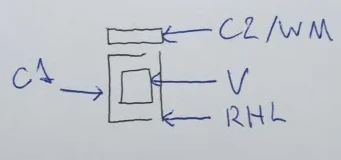

In this way, all graphs are monospacing horizontally.

I will explain what the C2/WM is in a bit. The C1 shows the onset consonant of a
syllable is, based on the modifications made to the base semi-square line which
"hugs" the V. These modifications correspond to their respective phonemes as
follows:

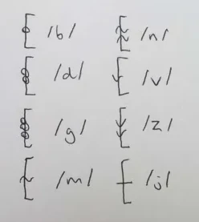

And the V shows the nucleus vowel of a syllable. The square in the labeled graph
is replaced by one of the following to represent the corresponding nucleus
vowels:

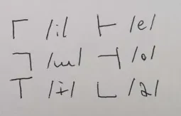

The way I derived these symbols is mostly arbitrary for the C1, but the V is
based entirely (with some minor creative liberty) on the International Phonetic
Alphabet vowel chart, as it is commonly rendered. Each V is made of two lines,
the intersection point of which corresponds roughly to where the vowel falls on
the vowel chart. If you ever forget the precise phonemic value of the Quevish
vowels, it can be roughly derived from the V graphemes; which I reckon is a nice
feature. The consonants are mostly arbitrary and vibes-based, but the plosives
all have circles, the nasals all have tilde-like waves (based on the IPA
diacritics for nasalization), the fricatives all have downward-pointing arrows,
and the palatal approximant is just a line since I couldn't think of anything
more intuitive that was still readable.

As an example of a word written in this orthography (ignoring C2/WM, we'll get
there), we can take the verb phrase initializer, "guby":

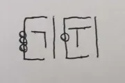

... which is written the way it is because:

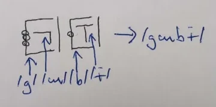

So that should give you an idea of how the Basic Featural Orthography works for
C-V pairs. Notice that, as I said, the RHL has no phonemic value and is only
used for written clarity to make it easier to quickly read two separate graphs
as being - indeed - separate.

As for the C2/WM, it makes sense to consider it as being divided into three
parts, all of which are optional and used only in specific situations. These
parts are the word start (WS), the second consonant (C2), and the word end (WE).
They are divided in a manner like this:

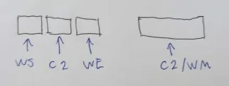

... where the collective whole (C2/WM) is divided into the WS on the left, the
C2 in the middle, and the WE on the right. The WS and WE have no direct value on
the phonemic values within a syllable, but rather dictate interations *between*
syllables. Rather intuitively, the WS (word start) is written if a syllable is
word-initial and the WE (word end) is written if a syllable is word-terminal. If
a word consists of one syllable, you would expect both to be present. The WS is
written as a diagonal down-right facing line, the WE as a dialogal up-right
facing line. See below an example of what a word-initial, word-middle, and
word-final syllable ("wi") would look like according to this rule:

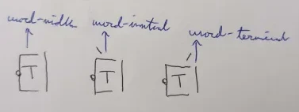

If you remember back to the phonotactics, there are three possible syllable
structures: CV, CVm, and CVn. The C2 of a graph is used to indicate the phonemic
value of the coda consonant of a syllable. If it is absent, the syllable has no
coda consonant and takes the CV form. Otherwise, the C2 corresponds to the "m"
and "n" sounds as follows:

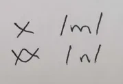

As an example of how the C2 is written, see the following word, written with WS
and WE omitted but featuring C1, V, C2, and RHL:

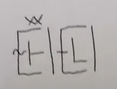

... written as such because:

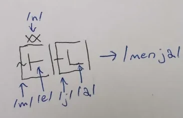

And for an in-practice example, take the sentence "wi guby goju":

```
wi     guby   goju
living VPINIT VPAS
```

trans. "living happens", "things are alive", "life is occuring", etc.

Which is written as:

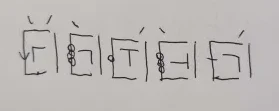

... because:

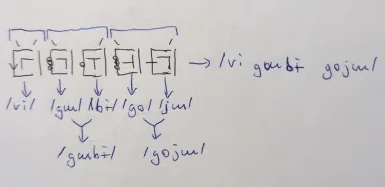

In this larger example we see a demonstration of all the orthographic features
except for the graph C2. It is easy to see at a glance where words begin and end
due to the symmetric WS-WE markings, allowing the Basic Featural Orthography to
be written without requiring any spacing between graph, which is done when using
this system. Spacing is arbitrary in the BFO and is mostly insignificant, having
no influence on the written value of a phrase. However, this is untrue in the
context of larger writing. Due to there being no punctuation marks, spacing
ought to be used when separating:

* Sentences (use one unit of space equivalent in horizontal width to the
  monospace width of a graph)
* Quotation (use two or more units)
* Paragraphs (use two or more units)

Of course, you don't actually *need* to follow these spacing guidelines if
contextually unnecessary, but I still recommend that you do, it aids readability
and helps disambiguate various sentence boundaries in general.

### Syntactic Featural Orthography

stuff will be added here eventually...

## Larger Usage Examples

stuff will be added here eventually...

## Glossing Abbreviation Table

| **Abbreviation** | **Meaning**                       |
|------------------|-----------------------------------|
| MOD              | "ga" modifier                     |
| VPINIT           | "guby" verb phrase initializer    |
| NPINIT           | "gane" noun phrase initializer    |
| ID               | "zi" identity requeuer            |
| VPNPCOM          | "zewi" intransitive VPNP combiner |
| VPAS             | "goju" VP asserter                |
| TGAP             | "zywo" target applier             |

## Root Reference Dictionary

This should not be treated as an exhaustive list of root definitions. In fact,
they aren't really "definitions" at all. Instead, these are just some words
intended to describe the "vibe" of various roots. By design, Quevish roots are
extremely broad in meaning and you may attribute personal qualities to each of
them, which may alter your interpretation of the language heavily.

| **Root** | **Meaning**                                        |
|----------|----------------------------------------------------|
| be       | material, really existing, actual                  |
| bo       | advanced, experienced, capable of thought          |
| bym      | usage, consumption, exploitation, able to be used  |
| da       | immaterial, ideal, not existing, conceptual        |
| du       | good, helpful, kind, simple                        |
| jo       | bad, evil, harmful, complicated                    |
| ju       | communication, talking, language, linguistics      |
| mo       | quantity, large, number, many, enlargement, growth |
| my       | solid, single part, whole, entirety                |
| myn      | liquid, gaseous, fluid, changing, in flux          |
| no       | small, few, shrinking, reduction in scope          |
| ny       | primitive, incapable of thought                    |
| wi       | living, moving, target of empathy                  |
| wo       | life sustaining, life causing, divine              |
| wun      | requirement, prerequisite, before, previous        |
