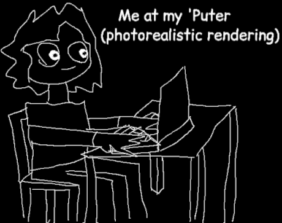

(this is me)

# About me

* Main online usernames: tirimid, Tirimid, polytopelover
* Preferred pronouns: any
* Languages I understand: English, Russian
* Some things I like: Programming, cool design, math, electronics, writing,
  conlangs
* Some things I hate: Bloatware, planned obsolescence, the advertising industry
* Favorite operating systems: Gentoo Linux, Arch Linux
* Favorite programming languages: C, (minimal subset of) C++
* GitHub: [tirimid](https://github.com/tirimid)

Hello, I'm tirimid (sometimes Tirimid or polytopelover) and this is my personal
website for publishing things I make - which means essays, guides,
documentation, and so on. Whenever I create something that I want to put out
into the world for others to see, I will probably create a page about it on this
site. Obviously not everything I've ever made is something I'm comfortable with
uploading here, so this is not a definitive catalog of my works.

I am strongly in favor of free software, privacy, and security. The source code
to this website is available at [its GitHub](https://github.com/tirimid/tirimid.net).

If you need to contact me for some reason, you can send an email to
tirimid@tirimid.net. I usually check this mailbox at least once a day, but do
not expect an immediate response.

# Aggregated pages

* [BFC](tirimid/bfc.md): A tiny brainfuck compiler that turns Brainfuck source
  input into GNU-as-compatible assembly output
* [escl](tirimid/escl.md): A hyperminimalist privelege elevation program,
  similar to sudo or doas
* [ipa-translate](tirimid/ipa-translate.md): A Rust crate for translating ASCII
  text into the International Phonetic Alphabet (IPA)
* [medioed](tirimid/medioed.md): My personal mediocre text editor
* [mincbuild](tirimid/mincbuild.md): A minimal C(++) buildsystem which doesn't
  require you to learn any new technology, like a DSL
* [Quevish](tirimid/quevish.md): A conlang based on semantic "evaluation" of a
  queue with a fairly regular and consistent syntax
* [The Sleeptalker Ritual](tirimid/sleeptalkerritual.md): A ritualpasta-style
  thing about talking to spirits by doing an intentional possession of a person
* [VVSML](tirimid/vvsml.md): A very simple markup language with fun syntax and
  utterly deranged features
* [What was the First Rhythm Game?](tirimid/firstrg.md): A short historical work
  of research, trying to figure out what the first rhythm game was
