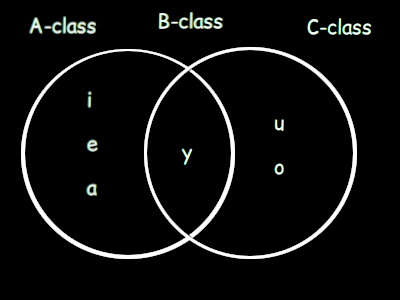
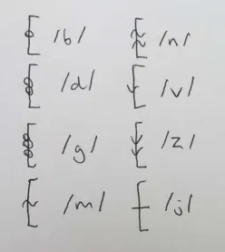
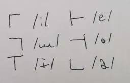
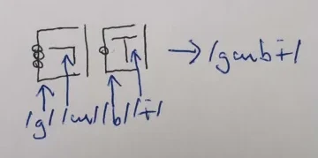
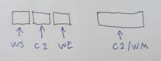
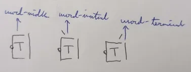
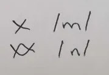
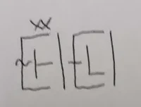
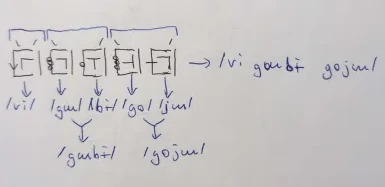

# Introduction

Quevish is a conlang I made. This page serves as the official documentation,
reference grammar, textbook examples, and base reference dictionary. The main
design principle is syntactic consistency and allowance of expressing yourself
semantically in interesting ways. The glossing abbreviations used for sentence
examples throughout the page can be found at the end.

# Phonology

## Phoneme inventory + Romanization

In the Latin-script orthography for Quevish, capitalization is irrelevant and it
is written case-insensitively. For conventional consistency, I will be writing
Romanized Quevish entirely in lowercase and recommend that you do the same.

All consonants in Quevish are voiced, I think this gives an interesting sound to
the language. Below are the Quevish consonants presented over the typical
International Phonetic Alphabet table with their Romanizations:

| **-**           | **Bilabial** | **Labiodental** | **Alveolar** | **Palatal** | **Velar** |
|-----------------|--------------|-----------------|--------------|-------------|-----------|
| **Plosive**     | b            | -               | d            | -           | g         |
| **Nasal**       | m            | -               | n            | -           | -         |
| **Fricative**   | -            | w               | z            | -           | -         |
| **Approximant** | -            | -               | -            | j           | -         |

All vowels in Quevish are unrounded, with the exception of "o", which is
rounded. See below the vowels along with their Romanizations:

| **-**         | **Front** | **Center** | **Back** |
|---------------|-----------|------------|----------|
| **Close**     | i         | -          | u        |
| **Nearclose** | -         | y          | -        |
| **Openmid**   | e         | -          | o        |
| **Open**      | a         | -          | -        |

## Phonotactics

There are a few things to talk about here. Namely: basic rules for maintaining
future consistency should I ever choose to work further on Quevish, which
combinations of consonants and vowels consitute legal syllables, and gemination
and vowel harmony rules.

First, consistency. All syllables in Quevish take the form of a consonant,
followed by a vowel, optionally followed by either "m" or "n". This is kind of
like how in Japanese a syllable will end in either a "n" sound or a vowel, and
where I took this idea from. So, laying it out in a visually easier format, we
get the following legal syllable structures:

* CV
* CVm
* CVn

Also, the second rule for guaranteeing consistency (oriented towards future
compatibility) is that all word-initial syllables beginning with either "g" or
"z" are reserved for grammatical use and are not allowed for roots. The
difference between grammatical particles and roots will be explained - but it's
probably good enough to think of them as function words vs. content words in
order to understand why I would want to reserve this. Thus, I guarantee that no
roots in the official reference dictionary provided on this page will begin in
"g" or "z".

Second, here is a table of which C-V pairs can appear in a syllable. Those not
present in the table are illegal and phonotactically disallowed from appearing
within syllables:

| **-** | **b** | **d** | **g** | **m** | **n** | **w** | **z** | **j** |
|-------|-------|-------|-------|-------|-------|-------|-------|-------|
| **i** | bi    | -     | -     | mi    | ni    | wi    | zi    | -     |
| **u** | bu    | du    | gu    | mu    | nu    | wu    | zu    | ju    |
| **y** | by    | dy    | gy    | my    | ny    | wy    | zy    | -     |
| **e** | be    | de    | -     | me    | ne    | we    | ze    | je    |
| **o** | bo    | do    | go    | mo    | no    | wo    | zo    | jo    |
| **a** | ba    | da    | ga    | ma    | na    | wa    | za    | ja    |

The eliminated ones are chosen fairly arbitrarily, either because I couldn't
easily pronounce them or I felt they didn't really fit within the context of the
other legal syllables.

Third, gemination and harmony rules. For gemination, there is only one rule -
multiple "m"s and "n"s cannot occur consecutively. Since, as a result of the
other phonotactical rules, this might only happen with two-letter long
scenarios, the rule on what to do is defined in terms of two-letter
modification. Namely, if multiple "m"s or "n"s occur consecutively, the second
letter is changed to the other. For example, the word "janna" would become
"janma", and "jamma" would become "jamna". In practice, this is like
search-replacing all "mm"s to "mn"s, and all "nn"s to "nm"s.

As for vowel harmony, the way it works is that there are three classes of
vowels, A-class, B-class, and C-class. These classes are composed as follows:

| **A-class** | **B-class** | **C-class** |
|-------------|-------------|-------------|
| i, e, a     | y           | u, o        |

... and these classes share overlap in a certain way. A-class vowels can only
occur in words without C-class vowels. Likewise, C-class vowels can only occur
in words without A-class vowels. B-class vowels can occur in all words, no
matter what other vowels the word contains. As such, we can view A-class and
C-class vowels as mutually exclusive over a word, and B-class words as not
having this restriction.

As a simple visualization, I have created this Venn diagram (see below). Only
vowel classes with overlap may co-occur in a word:



Since Quevish is a morphologically very simple language, there are no rules for
vowel assimilation as there are no scenarios in which it has any reason to
occur. The above phonotactic rules are more design guidelines for adding new
roots or grammatical particles to the language.

# Grammar

Quevish is an analytic language with focus on expression-based syntax. The
syntax of the language consists of "roots" and "grammatical particles", the
latter modifying the former to create meaning in a sentence. Phrases are said in
a kind of "queue notation", such that the roots are operands and the particles
are operators. Then, the sentence is "evaluated" on a "queue" to create meaning.
Hence, the "Quev" in Quevish, which stands for "Queue evaluation".

This evaluation process happens as follows:

1. Run through the words in the phrase in sequence until you encounter a
   grammatical particle, pushing any roots to the evaluation queue in the
   process
2. Once you encounter a grammatical particle, the correct number of operands is
   dequeued from the evaluation queue and operated on by the particle
3. The result of the operation is pushed to the queue - all grammatical
   particles will push exactly one thing to the queue
4. Jump back to the first step if there are still more words left to read in the
   phrase, otherwise go to the next step
5. If there is more than one operand in the evaluation queue, the phrase was
   malformed and has no meaning; otherwise the only item remaining in the queue
   is to be taken as somehow representing the information of the phrase

This is very programming-language-ey but that's kind of the goal with Quevish.
In practice, you can treat most grammatical particles as case markers or other
conventional syntactical features, just with slightly wackier format. Still,
this is the actual process according to which phrases and sentences are
evaluated, so forming them should simply follow the inverse process.

## Grammatical particles

### Modifier - "ga" particle

When you want to combine words (as in, making compound "words", using adjectives
to describe something, etc.) the "ga" grammatical particle is used. It takes two
operands and marks that its first operand is modified in some way by its second
operand.

Example:

```
wi
living
```

trans. "creature"

```
wi     bo       ny
living advanced primitive
```

trans. (malformed expression, no meaning)

```
wi     bo       ga  ny        ga
living advanced MOD primitive MOD
```

trans. "animal", "animals", "animalistic", etc.

Since Quevish does not explicitly distinguish between adjectives, nouns,
plurality, or anything like that by default - and instead relies on context or
use of specific grammatical particles for disambiguation, the actual meaning of
the above phrase is dependent on more than the phrase itself. Still, it is meant
to capture the "essence" of "animalness" if you will.

### Verb phrase initializer - "guby" particle

In Quevish, sentences must be built from the ground up, and the speaker may add
in (or omit) as much information as they can reasonably desire. Sentences must
contain at least a verb phrase. A verb phrase is simply a "verb" which may be
modified by other words or phrases, and may modify other words or phrases. The
"guby" particle is used to mark something as being a verb phrase, most commonly
a root. It takes one operand, marks it as a verb phrase, and then pushes the
marked operand to the queue. The pushed operand may then be used like any other,
and modified using the "ga" particle. Effectively, this allow you to describe it
using a kind of "adverb".

Example:

```
ju
language
```

trans. "talking"

```
ju       guby
language VPINIT
```
v
trans. "to talk", "is talking", "was communicating", "will send messages", etc.

```
ju       guby   bo       ga
language VPINIT advanced MOD
```

trans. "to talk eloquently", "was communicating with experience", etc.

Note that "guby" does not require, nor does it introduce, any tense, aspect, or
other such information to the verb phrase. Thus, as seen above, it can imply
many meanings - the key similarity is that all of them are in some way or
another derived from the underlying meanings of the roots. All of them have
*some* relation to "advancedness" and communication, and this relation is in the
form of roots to verb phrases.

Quevish, as a language, is very open to interpretation in this way. Your
conception of the roots' meanings will fundamentally determine your usage of the
language. Your conception of what it means to "modify" something will too,
similarly so. In this way, it is somewhat toki-pona-esque, as it forces you to
question the nature of something before being able to talk about it, it forces
you to think about the way in which different parts of a phrase are really
related to each other.

### Noun phrase initializer - "gane" particle

A noun phrase in Quevish is just a "noun" marked as being a noun phrase. Noun
phrases may be modified like anything else, and may be used as modifiers like
anything else. The "gane" particle takes one operand, marks it as a noun phrase,
and pushes the marked operand back to the evaluation queue. Basically, its the
same thing as "guby" particle except for noun phrases instead of verb phrases.

While it is up to the individual speaker / listener, the way I interpret
modifying noun phrases is that modifying them by a root is like describing it
with an adjective, and modifying them with another noun phrase is like creating
a compound word.

Example:

```
wi     bo       ga  ny        ga  gane
living advanced MOD primitive MOD NPINIT
```

trans. "animal"

```
wi     gane
living NPINIT
```

trans. "life"

```
wi     guby   gane
living VPINIT NPINIT
```

trans. "the action of living"

One interesting thing that can be done (as demonstrated above) is the marking of
verb phrases as noun phrases. This is possible because the phrase initializer
particles are not limited with what they can accept as operands. What seems most
intuitive to me for the interpretation of a verb phrase marked as a noun phrase
is that it is effectively a gerund or participle-ey thing.

### Identity requeuer - "zi" particle

Whenever you need to shuffle the queue, the "zi" identity grammatical particle
can be used. All it does is dequeue an item from the evaluation queue, and
immediately requeue it without any processing. This has the effect of moving the
front item to the back of the queue.

Example:

```
wi     jo  ga
living bad MOD
```

trans. "living thing that is evil"

```
wi     jo  zi ga
living bad ID MOD
```

trans. "evil thing that is living"

```
jo  wi     ga
bad living MOD
```

trans. "evil thing that is living"

You can see that the last two evaluate to the same thing. That is because, in
this example, the "zi" identity requeue simply swaps the order from the front of
both items in the evaluation queue, so "wi jo zi" and "jo wi" are effectively
the same thing. In these small examples, the "zi" particle appears to not be
very useful, but it becomes absolutely essential for queue manipulation in
anything meaningfully complex.

### Intransitive VPNP combiner - "zewi" particle

If you want to form an intransitive sentence / phrase (one with a subject and
verb), the "zewi" grammatical particle is used. It takes two operands, the first
of which must be a verb phrase, and the second of which must be a noun phrase.
It pushes to the evaluation queue an item representing a phrase where the verb
phrase (first operand) is somehow acted out by the noun phrase or subject
(second operand). Generally the subject will be the agent of the action but the
actual nature of what does the action, what the action is, and how it works is
determined by the operands themselves, as well as context.

Example:

*(For these more complicated phrases I am including lisp-style tree
representations of the evaluated meaning as well as the usual gloss, as it will
aid the ability to understand why the translations mean what they do.)*

```
bym my    ga  guby   wi     bo       zi ga  ny        zi ga  zi gane   zewi
use solid MOD VPINIT living advanced ID MOD primitive ID MOD ID NPINIT VPNPCOM

(VPNPCOM
  (VPINIT (MOD bym my))
  (NPINIT (MOD (MOD wi bo) ny)))
```

trans. "the animal is eating", "an animal was eating", "animals eat", etc.

```
bym myn    ga  guby   wi     bo       zi ga  ju       zi ga  zi gane   zewi
use liquid MOD VPINIT living advanced ID MOD language ID MOD ID NPINIT VPNPCOM

(VPNPCOM
  (VPINIT (MOD bym myn))
  (NPINIT (MOD (MOD wi bo) ju)))
```

trans. "people drink", "the man will drink", "the women drank", etc.

Of course, "bym my ga guby" and "bym myn ga guby" don't explicitly mean "drink"
or "eat", but I'm just using them that way in the context here. They refer more
broadly to using liquids / solids, but you still get the idea...

With these slightly more complicated full sentence examples, the need for an
identity requeue operator becomes very clear. Since Quevish works on a queue and
not a stack, it would be impossible to refer to information which has just been
introduced to the phrase without shuffling the current front items to the back
of the queue. This is also one of the reasons that Quevish is not a practical
language for actual use, as it simply makes more sense to humans when you talk
about the most recently introduced concept, rather than having to shuffle them
around. Perhaps a version of the language that operates on a stack instead of a
queue would be more human-usable.

### VP asserter - "goju" particle

This particle is used in the situation that you want to mark a verb *as*
occuring, without giving it a subject or an agent to perform it. Since a verb
phrase is just a relationship and does not actually imply anything material, the
"goju" particle is used whenever you *do* want to imply something material. The
"goju" particle takes one operand, a verb phrase or any other phrase constituted
of a verb phrase (such as the combined VPNP from the "zewi" particle), asserts
it as being something that materially occurs rather than just a semantic idea,
and pushes the result to the queue. The result may be treated as an "asserted
verb phrase", a subset of all verb phrases with the implication of material
occurrance.

The "zewi" particle is by default assumed to work this way as well, although you
can theoretically mark it with "goju" to make it explicit. So, "goju" can also
be used for emphasis.

Example:

```
wi     guby
living VPINIT
```

trans. "living", "to live", "to be alive", etc.

```
wi     guby   goju
living VPINIT VPAS
```

trans. "living, which is a thing that occurs", "being alive happens", etc.

The interesting thing about this particle is mainly that it allows subjectless
sentences, but I also think it's just interesting to consider what this kind of
language feature implies about using it to describe actions; since it creates a
linguistic imposition of a difference between an action existing in some
abstract, nonperformable state, and an action existing in a state of being
performed abstractly. It's a bit difficult to put into words, but think of a
more explicit relationship between the idea of running as a concept and the idea
of running as a material action that is being performed.

That's not really anything particularly amazing as far as languages or
philosophy go, but I still like the way in which the distinction is implemented
here.

One cool thing you can do though is this:

```
wi     guby   goju goju
living VPINIT VPAS VPAS
```

trans. "living happening happens", "living, which happens, which happens", etc.

And that's just really fun.

### Target applier - "zywo" particle

The "zywo" particle is used to apply some target to a phrase. It takes two
operands - both being phrases, marks the first as somehow "tending towards" or
"targeting" the second, and enqueues the result of this operation; allowing the
result to be used as the same type of phrase as the first operand. There are a
few possible ways in which this could appear to be useful, the most obvious of
which is that it provides a way to modify intransitive verbs to give them an
object, thus making them transitive. But, also, it ought be understood that this
is not the *only* way to use "zywo". The particle itself is just an assertion
that one thing targets, goes towards, tends towards, etc. another. You could
just as easily use it to describe mathematical limits; where one value tends to
another, or the tendency of the rate of profit to fall, or my own tendency to do
useless creative projects. You might also use it to describe the tendency of an
action to slow over time. The main point is that it describes a target or
tendency in a neutral sense.

Example:

```
bym myn    ga  guby   wi     bo       zi ga  ju       zi ga  zi gane   zewi
use liquid MOD VPINIT living advanced ID MOD language ID MOD ID NPINIT VPNPCOM

myn    wo           zi ga  zywo
liquid life-causing ID MOD TGAP

(TGAP
  (VPNPCOM
    (VPINIT (MOD bym myn))
    (NPINIT (MOD (MOD wi bo) ju)))
  (NPINIT (MOD myn wo)))
```

trans. "people drinking water", "humanity making use of water", etc.

```
wo     be     ga  mo    ga  gane   no     zi ga  zi gane   zywo
divine actual MOD large MOD NPINIT shrink ID MOD ID NPINIT TGAP

(TGAP
  (NPINIT (MOD (MOD wo be) mo))
  (NPINIT no))
```

trans. "religion shrinking in scope", "religiosity becoming less popular"

Remember that "zywo" is largely a grammatical, not necessarily strictly
semantic, assertion of tendency. The actual example here is not really a
sentence stating that "religion *is* becoming less popular", but rather the idea
*of* religion becoming less popular. If you actually wanted to say that, you
could say:

```
wo     be     ga  no    ga  gane   no     zi ga  zi gane   zywo guby   goju
divine actual MOD large MOD NPINIT shrink ID MOD ID NPINIT TGAP VPINIT VPAS

(VPAS
  (VPINIT
    (TGAP
      (NPINIT (MOD (MOD wo be) mo))
      (NPINIT no))))
```

trans. "religion is shrinking in scope", "religiosity is becoming less popular",
etc.

### Passive negator - "zezy"

The "zezy" particle is used to passively negate a phrase or a root. Quevish
distinguishes between "passive negation" and "active negation". Passive negation
is simply the absence of something, while active negation is the presence of its
opposite. For roots and noun phrases, passive negation means forming a
"non"-word. For verb phrases, it means the same thing but in verb form.

For example, take the verb phrase:

```
bym my    ga  guby
use solid MOD VPINIT
```

trans. "to eat", "to have eaten", "eating", etc.

... and compare it to its passive negative:

```
bym my    ga  guby   zezy
use solid MOD VPINIT PNEG
```

trans. "to not eat", "to have not eaten", "not eating", etc.

The passive negator is self-inverting; that is, passively negating something
which is already passively negative will cancel out the negation. However, this
is *only* the case if applied directly to a passive negative. E.g., if you apply
zezy to a word, then modify it with the "ga" modifier, then apply zezy again, it
will not cancel out the original one.

For example:

```
bym my    ga  guby   zezy zezy
use solid MOD VPINIT PNEG PNEG

(PNEG
  (PNEG
    (VPINIT (MOD bym my))))
```

trans. "to not not eat" = "to eat", "to have not not eaten" = "to have eaten",
etc.

```
bym my    ga  guby   zezy jen    ga
use solid MOD VPINIT PNEG hidden MOD

(MOD
  (PNEG (VPINIT (MOD bym my)))
  jen)
```

trans. "to secretly not eat", "to have secretly not eat", "privately not
eating", etc.

```
bym my    ga  guby   zezy jen    ga  zezy
use solid MOD VPINIT PNEG hidden MOD PNEG

(PNEG
  (MOD
    (PNEG (VPINIT (MOD bym my)))
    jen))
```

trans. "to not secretly not eat", "to not have secretly not eaten", "not
privately not eating", etc.

Looking at the syntax trees, the application of the self-inversion rules becomes
much more evident. Basically, an odd number of passive negations on a single
node in the syntax tree is equivalent to a single passive negation - which an
even number is equivalent to none.

### Active negator - "gezy"

The "gezy" particle is used to actively negate a phrase or a root. As described
in the "zezy" section, active negation implies the presence of a phrase or
root's opposite, rather than an absence of its value. For roots and noun
phrases, active negation means forming a "counter"-word. For verb phrases, it
means either forming a counter or a "reverse" word.

To clarify the difference between active and passive negation, see the following
examples:

```
bam zezy
war PNEG
```

trans. "non-war", "peaceful", "calmness", etc.

... compared to:

```
bam gezy
war ANEG
```

trans. "anti-war", "against conflict", "counterterrorism", etc.

As for verb phrases, they can - as stated - be either "counter" or "reverse",
which should be determined based on context. A "counter"-verb is exactly what it
seems like, and is semantically similar to how the above example works. A
"reverse"-verb, however, is not. Rather than implying the presence of a verb's
opposite, it implies the presence of a verb's reverse - like the English "un-"
morpheme.

If we take the verb phrase "bym my ga guby" (trans. "to eat") and actively
negate it, we can interpret the difference between reverse negation and counter
negation as follows:

| **Verb phrase**     | **Negation type** | **Meaning**           |
|---------------------|-------------------|-----------------------|
| bym my ga guby      | None              | to eat                |
| bym my ga guby zezy | Passive           | to not eat            |
| bym my ga guby gezy | Active reverse    | to "un-eat"           |
| bym my ga guby gezy | Active counter    | to vomit, to defecate |

The active reverse has no good translation in English, since "un-eating" isn't
something we conceptualize as a meaningful idea. However, this is what the
phrase means when negated in active reverse.

*(Maybe "un-eat" means something like spitting out food? I interpret it as food
rebuilding itself in the reverse way of how it was eaten, but Quevish allows
some ambiguity.)*

Unlike the passive negator, "zezy", the active negator gezy is not
self-inverting. That is, if the phrase "bam gezy gane" means counterterrorism,
then "bam gezy gezy gane" is *not* just terrorism. It would, instead, be
translated as something along the lines of "the movement fighting
counterterrorism", rather than terrorism itself. This example assumes both
negations are active counter - but if we assume only the first one is active
counter and the second is actually active reverse, then we could instead
translate it as something like "the undoing of counterterrorism measures". As
stated before, it is dependent on context whether or not any individual "gezy"
implies active reverse or active counter negation.

### Interrogative mood marker - "zanme"

When asking a question, the verb in the question phrase must be marked as
interrogative. By default, verbs are in the indicative mood, representing some
kind of factual descriptor or material status. And in order to inquire about the
value of something in a sentence, this is inappropriate - so the interrogative
mood is used.

The "zanme" grammatical particle is used for this. It takes one operand which is
an asserted verb phrase, marks it as interrogative, and enqueues the result as a
mood-marked asserted verb phrase. A "mood-marked verb phrase" is distinct from a
"verb phrase" - the difference being that mood-marked verb phrases cannot be
used as arguments for the mood marker particles, including zanme. In all other
cases, mood-marked asserted verb phrases may be used as any other asserted verb
phrase.

If neither the subject or object(s) of an interrogative-marked verb is a
question pronoun, or the verb does not have them, the question is asked with the
intention of receiving a boolean response - either true or false.

For example:

```
wo     be     ga  no    ga  gane   no     zi ga  zi gane   zywo guby   goju
divine actual MOD large MOD NPINIT shrink ID MOD ID NPINIT TGAP VPINIT VPAS

zanme
INT

(INT
  (VPAS
    (VPINIT
      (TGAP
        (NPINIT (MOD (MOD wo be) mo))
        (NPINIT no)))))
```

trans. "is religion shrinking in scope?", "is religiosity becoming less
popular?", etc.

In order to respond to such a question (a *boolean* interrogative-marked
sentence - non-boolean questions will be covered in the question pronouns
section), you can say one of two things. Either you can reiterate the contents
of the sentence in the indicative mood as an asserted verb phrase, using the
passive negative if the answer is false; or you can respond using the roots
"min" for truth, and "nin" for falsehood, relying on the other person to
contextually determine the semantics of what you are saying.

Example dialog:

* A: wo be ga no ga gane no zi ga zi gane zywo guby goju zanme
* B: min

trans.:

* A: is religion becoming less popular?
* B: yes

... or:

* A: wo be ga no ga gane no zi ga zi gane zywo guby goju zanme
* B: wo be ga no ga gane no zi ga zi gane zywo guby goju

trans.:

* A: is religion becoming less popular?
* B: religion is becoming less popular

For common conversation, the former option is easier and more practical. But for
formal writing or professional interaction, you would probably want to use the
latter in order to avoid ambiguity.

### Tense markers

Tense markers are grammatical particles used to indicate the relative position
of events on the timeline under consideration, similar to how most other
languages do it. They each take one argument, a verb phrase, marks it as
occurring on the point on the timeline specified by its tense, and enqueues the
result as a tensed verb phrase. Here, a "tensed verb phrase" is distinct from a
"verb phrase" - the difference being that tensed verb phrases cannot be used as
arguments for the tense marker particles. In all other cases, tensed verb
phrases may be used as any other verb phrase.

There are six tenses:

* Ancient past (roughly 500+ years ago)
* Distant past (roughly 100+ years ago)
* Proximate past (roughly 0-100 years ago)
* Present (current events)
* Proximate future (roughly 0-100 years in the future)
* Distant future (roughly 100+ years in the future)

Immediacy v.s. habituality are not distinguished. That is, Quevish makes no
distinction between "the man eats" and "the man is eating":

```
bym my    ga  guby   wi     bo       zi ga  ju       zi ga  zi gane   zewi
use solid MOD VPINIT living advanced ID MOD language ID MOD ID NPINIT VPNPCOM

(VPNPCOM
  (VPINIT (MOD bym my))
  (NPINIT (MOD (MOD wi bo) ju)))
```

trans. "the man eats", "the man is eating", "the woman eats", etc.

The above example does not make use of the tense marking particles, and I have
just included it to demonstrate my point that immediacy / habituality are not
considered in Quevish.

As for tense markers, the following particles are used:

| **Marker** | **Tense indicated** |
|------------|---------------------|
| gymbi      | Ancient past        |
| gymbe      | Distant past        |
| gymba      | Proximate past      |
| gymby      | Present             |
| gymbo      | Proximate future    |
| gymbu      | Distant future      |

You will notice that I have used the terminal vowels of these words in a very
specific way to connect tense to a phonemic value. Front vowels fall under the
"past" umbrella, and back vowels fall under the "future" umbrella. The more open
the vowel is, the closer to the current moment the represented tense is. The
present tense marker, "gymby", has a center vowel; which is representative of
the present being between the past and the future (center vowels are between
front and back vowels).

For examples of these tense markers, see the following:

```
bym my    ga  guby   gymbi wi     bo       zi ga  ju       zi ga  zi gane
use solid MOD VPINIT APST  living advanced ID MOD language ID MOD ID NPINIT

zewi
VPNPCOM

(VPNPCOM
  (APST (VPINIT (MOD bym my)))
  (NPINIT (MOD (MOD wi bo) ju)))
```

trans. "[in ancient times,] people were eating", "[long ago,] humanity ate",
etc.

```
bym my    ga  guby   gymbo wi     bo       zi ga  ju       zi ga  zi gane
use solid MOD VPINIT PFUT  living advanced ID MOD language ID MOD ID NPINIT

zewi
VPNPCOM

(VPNPCOM
  (PFUT (VPINIT (MOD bym my)))
  (NPINIT (MOD (MOD wi bo) ju)))
```

trans. "people are soon going to eat", "a person will eat soon", etc.

Another thing worthy of consideration is the point around which the relative
points in time of the tenses orient themselves - so what is it? This is
determined by the position on the timeline of the point-of-view speaker, which
is itself determined contextually. So, for example, if I was speaking from the
perspective of a soldier during the second world war, I would say "I am
fighting" (using the verb phrase: bam guby gymby) rather than "I was fighting"
(using the verb phrase: bam guby gymba). However, if I was talking *about* that
soldier, as a modern observer rather than a historical point of view, I would
use the proximate past tense.

So, tenses orient themselves relative to the point-of-view's position on the
timeline rather than the actual speaker's position on the timeline.

### AND-ative joiner - "gemi"

stuff will be added here eventually...

### OR-ative joiner - "gumo"

stuff will be added here eventually...

### XOR-ative joiner - "gumon"

stuff will be added here eventually...

## Pseudo-roots

Besides roots and grammatical particles, there are also pseudo-roots. I did not
include them in the definition for how syntax is evaluated because they are
actually just treated identically to roots. A pseudo-root is a word in a
sentence which serves a grammatical purpose but acts like a semantic unit
(root). They are needed because some words have meaning which is determined
syntactically and contextually but that also implies information beyond that of
a root.

To put it in the simplest possible terms, while roots are purely semantic and
imply nothing grammatically, psuedo-roots are conventional grammatical
structures that are syntactically treated as if they were roots.

### Personal pronouns

Quevish distinguishes personal pronouns along two categories, gender and number.
There are four gender classes: masculine, feminine, third, and generic other.
The gender of a pronoun aligns with the gender of the antecedent - although if
the antecedent is a person, you should always use the gender category that they
prefer, regardless of whether or not it aligns with the gender they identify
with. There are also three number classes: single, paucal, and plural.

The gender classes are defined like this:

* Masculine: used for men and things generally viewed as male
* Feminine: used for women and things generally viewed as female
* Third: used for anyone who wishes not to identify with either the masculine or
  feminine class, and things generally viewed as having a gender that isn't male
  or female
* Generic other: used when the antecedent either does not have a gender, or has
  a gender which is ambiguous and unclear

The generic other gender would be used for inanimate objects whenever you don't
want to attribute a gender to them. If you *do* want to attribute a gender to
them (like if you're talking about a toy doll designed to look like a human),
you would use the appropriate masculine / feminine / third gender pronoun.

The number classes are defined like this:

* Single: used for singular, cohesive units (e.g. a body may consist of
  trillions of cells, but "a body" is a singular unit on a macro scale)
* Paucal: used to embody the concept of "a few" singular, cohesive units - what
  this means may depend on interpretation but is always more than one and less
  than ten, and always an integer number
* Plural: used when the single and paucal do not apply

The plural number is a catch all for non-single non-paucal. The most obvious
implication of this is that plural would be used for, e.g. a hundred of
something, but it also has other uses. Probably the most interesting is that the
plural number is always used when it comes to non-positive-integer amounts, like
0.5, -1, Pi, 0, sqrt(-1), etc. Single and Paucal can only be used for positive
integer values.

The full table of gender-number pronoun definitions is this:

| **-**             | **Single** | **Paucal** | **Plural** |
|-------------------|------------|------------|------------|
| **Masculine**     | zyju       | zyjun      | zyjum      |
| **Feminine**      | zyje       | zyjen      | zyjem      |
| **Third**         | zyjo       | zyjon      | zyjom      |
| **Generic other** | zyja       | zyjan      | zyjam      |

In order to make things more consistent, the word-terminal syllable's vowel
corresponds to the gender; and the coda consonant corresponds to the number.

You will notice that these pronouns do not contain information regarding person.
This is intentional, for use in situations where strictly encoding this
information is not necessary. So, for example:

```
wi     bo       ga  ju       ga  gane.  bym myn    ga  guby   zyje zewi
living advanced MOD language MOD NPINIT use liquid MOD VPINIT Xfsg VPNPCOM

[first sentence]
(NPINIT (MOD (MOD wi bo) ju))

[second sentence]
(VPNPCOM
  (VPINIT (MOD bym myn))
  Xfsg)
```

trans. "the woman is drinking", "the girl drinks", etc.

There are a few interesting things to dissect in this example.

First of all, pronouns are syntactically noun phrases. While they are
pseudo-roots in a strictly grammatical sense, they are semantically used to
substitute for noun phrases, and so they are noun phrases themselves, so you do
not need to mark them with "gane", as that would be redundant.

Second of all, even though the person of the pronoun is not specified, it is
obvious what it refers to anyway, through context. The first sentence
establishes the antecedent of the pronoun used in the second sentence. While
both sentences are syntactically valid, only the second one would be
semantically valid without the context of the other. When I say that encoding
person into the pronoun is sometimes not necessary, I am referring to these
kinds of situations.

Third of all, the example shows how pronouns can be used for disambiguation. The
first sentence only introduces something like "person", "humanity", or "people"
into the overall context. It is the fact that the pronoun used in the second
sentence is singular and feminine which allows the reader to deduce that the
first sentence refers to a woman or a girl. This kind of grammatical structure:
"{thing}. {verb} {pronoun}", should be used in Quevish for gender and number
disambiguation where applicable.

However, in some cases, you may want to clarify the person of a pronoun. For
this, these person suffixes are attached to the end of the pronoun:

| **Person** | **Suffix** |
|------------|------------|
| 1          | -ba/o      |
| 2          | -da/o      |
| 3          | -wa/o      |

Each suffix either ends with a front ("a") or a back vowel ("o"). The one you
choose to use depends on the other vowels in the word, and then you just select
whichever one doesn't violate the vowel harmony rules.

For example:

```
bym myn    ga  guby   zyjobo zewi
use liquid MOD VPINIT 1tsg   VPNPCOM

(VPNPCOM
  (VPINIT (MOD bym myn))
  1tsg)
```

trans. "I drink", "I will drink", "I had drunk", etc.

```
bam   guby   gymbo zyjobo zewi    zyjuwo zywo
fight VPINIT PFUT  1tsg   VPNPCOM 3msg   TGAP

(TGAP
  (VPNPCOM
    (PFUT (VPINIT bam))
    1tsg)
  3msg)
```

trans. "I'm gonna fight him", "I will have a conflict with him", etc.

### Question pronouns

stuff will be added here eventually...

### Proper nouns

stuff will be added here eventually...

# Number system

stuff will be added here eventually...

# Custom orthography

## Basic featural orthography

Sentences and phrases are divided into words, which are divided into syllables,
which are divided into phonemes. In the Basic Featural Orthography for Quevish,
each graph is divided into features; with graphs mapping directly to syllables
and features mapping (with two exceptions) directly to phonemes. Graph
directionality is not defined, but I will be using left to right, top to bottom,
and recommend that you do the same for the sake of consistency. If you wish to
use a different directionality, you may do so and should place a little marker
(perhaps an arrow) indicating it. You should assume that anything unmarked is
written left to right, top to bottom.

Each graph is divided into four features: the first consonant (C1), the vowel
(V), the right-hand line (RHL), and the optional second consonant and word
marker (C2/WM). The RHL is purely an orthographic feature with no influence on
the syllable derived from a graph, but the other features have very real
influence. These features are arranged within a graph as shown below:


In this way, all graphs are monospacing horizontally.

I will explain what the C2/WM is in a bit. The C1 shows the onset consonant of a
syllable is, based on the modifications made to the base semi-square line which
"hugs" the V. These modifications correspond to their respective phonemes as
follows:



And the V shows the nucleus vowel of a syllable. The square in the labeled graph
is replaced by one of the following to represent the corresponding nucleus
vowels:



The way I derived these symbols is mostly arbitrary for the C1, but the V is
based entirely (with some minor creative liberty) on the International Phonetic
Alphabet vowel chart, as it is commonly rendered. Each V is made of two lines,
the intersection point of which corresponds roughly to where the vowel falls on
the vowel chart. If you ever forget the precise phonemic value of the Quevish
vowels, it can be roughly derived from the V graphemes; which I reckon is a nice
feature. The consonants are mostly arbitrary and vibes-based, but the plosives
all have circles, the nasals all have tilde-like waves (based on the IPA
diacritics for nasalization), the fricatives all have downward-pointing arrows,
and the palatal approximant is just a line since I couldn't think of anything
more intuitive that was still readable.

As an example of a word written in this orthography (ignoring C2/WM, we'll get
there), we can take the verb phrase initializer, "guby":


... which is written the way it is because:



So that should give you an idea of how the Basic Featural Orthography works for
C-V pairs. Notice that, as I said, the RHL has no phonemic value and is only
used for written clarity to make it easier to quickly read two separate graphs
as being - indeed - separate.

As for the C2/WM, it makes sense to consider it as being divided into three
parts, all of which are optional and used only in specific situations. These
parts are the word start (WS), the second consonant (C2), and the word end (WE).
They are divided in a manner like this:



... where the collective whole (C2/WM) is divided into the WS on the left, the
C2 in the middle, and the WE on the right. The WS and WE have no direct value on
the phonemic values within a syllable, but rather dictate interations *between*
syllables. Rather intuitively, the WS (word start) is written if a syllable is
word-initial and the WE (word end) is written if a syllable is word-terminal. If
a word consists of one syllable, you would expect both to be present. The WS is
written as a diagonal down-right facing line, the WE as a dialogal up-right
facing line. See below an example of what a word-initial, word-middle, and
word-final syllable ("wi") would look like according to this rule:



If you remember back to the phonotactics, there are three possible syllable
structures: CV, CVm, and CVn. The C2 of a graph is used to indicate the phonemic
value of the coda consonant of a syllable. If it is absent, the syllable has no
coda consonant and takes the CV form. Otherwise, the C2 corresponds to the "m"
and "n" sounds as follows:



As an example of how the C2 is written, see the following word, written with WS
and WE omitted but featuring C1, V, C2, and RHL:



... written as such because:


And for an in-practice example, take the sentence "wi guby goju":

```
wi     guby   goju
living VPINIT VPAS
```

trans. "living happens", "things are alive", "life is occuring", etc.

Which is written as:


... because:



In this larger example we see a demonstration of all the orthographic features
except for the graph C2. It is easy to see at a glance where words begin and end
due to the symmetric WS-WE markings, allowing the Basic Featural Orthography to
be written without requiring any spacing between graph, which is done when using
this system. Spacing is arbitrary in the BFO and is mostly insignificant, having
no influence on the written value of a phrase. However, this is untrue in the
context of larger writing. Due to there being no punctuation marks, spacing
ought to be used when separating:

* Sentences (use one unit of space equivalent in horizontal width to the
  monospace width of a graph)
* Quotation (use two or more units)
* Paragraphs (use two or more units)

Of course, you don't actually *need* to follow these spacing guidelines if
contextually unnecessary, but I still recommend that you do, it aids readability
and helps disambiguate various sentence boundaries in general.

## Syntactic featural orthography

stuff will be added here eventually...

# Larger translation examples

## The North Wind and the Sun

stuff will be added here eventually...

## The Internationale

stuff will be added here eventually...

## The Lord's Prayer

stuff will be added here eventually...

# Root reference dictionary

This should not be treated as an exhaustive list of root definitions. In fact,
they aren't really "definitions" at all. Instead, these are just some words
intended to describe the "vibe" of various roots. By design, Quevish roots are
extremely broad in meaning and you may attribute personal qualities to each of
them, which may alter your interpretation of the language heavily.

| **Root** | **Meaning**                                        |
|----------|----------------------------------------------------|
| bam	   | fight, conflict, warfare, terrorism, unjust	|
| be       | material, really existing, actual                  |
| bo       | advanced, experienced, capable of thought          |
| bym      | usage, consumption, exploitation, able to be used  |
| da       | immaterial, ideal, not existing, conceptual        |
| du       | good, helpful, kind, simple                        |
| jen      | hidden, secret, encrypted, clandestine             |
| jo       | bad, evil, harmful, complicated                    |
| ju       | communication, talking, language, linguistics      |
| min      | truth, correctness, following standards, compliant |
| mo       | quantity, large, number, many, enlargement, growth |
| my       | solid, single part, whole, entirety                |
| myn      | liquid, gaseous, fluid, changing, in flux          |
| nin      | falsehood, defiance, incorrect, non-standard       |
| no       | small, few, shrinking, reduction in scope          |
| ny       | primitive, incapable of thought                    |
| wi       | living, moving, target of empathy                  |
| wo       | life sustaining, life causing, divine              |
| wun      | requirement, prerequisite, before, previous        |

# Glossing abbreviations

## Particle gloss tables

| **Abbreviation** | **Meaning**                       |
|------------------|-----------------------------------|
| MOD              | "ga" modifier                     |
| VPINIT           | "guby" verb phrase initializer    |
| NPINIT           | "gane" noun phrase initializer    |
| ID               | "zi" identity requeuer            |
| VPNPCOM          | "zewi" intransitive VPNP combiner |
| VPAS             | "goju" VP asserter                |
| TGAP             | "zywo" target applier             |
| PNEG             | "zezy" passive negator            |
| ANEG             | "gezy" active negator             |
| INT              | "zanme" interrogative mood marker |
| APST             | "gymbi" ancient past marker       |
| DPST             | "gymbe" distant past marker       |
| PPST             | "gymba" proximate past marker     |
| PRS              | "gymby" present marker            |
| PFUT             | "gymbo" proximate future marker   |
| DFUT             | "gymbu" distant future marker     |
| JAND             | "gemi" AND-ative joiner           |
| JOR              | "gumo" OR-ative joiner            |
| JXOR             | "gumon" XOR-ative joiner          |

## Personal pronouns

The gloss for personal pronouns takes the form of "{person}{gender}{number}".

Person may be one of:

* "X": unspecified
* "1": first
* "2": second
* "3": third

Gender may be one of:

* "m": masculine
* "f": feminine
* "t": third
* "o": generic other

Number may be one of:

* "sg": single
* "pc": paucal
* "pl": plural
